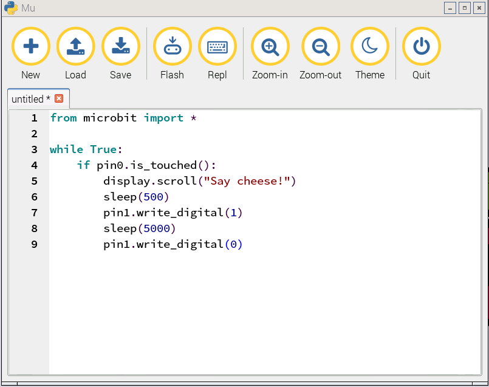

## Program the micro:bit trigger

- Open mu and click on **New** to open a blank untitled file. 
- Click on **Save**, name the file `microbit-trigger.py` and press Enter on your keyboard.
- The first line in your file should already be typed out for you and reads:
	
	```python
	from microbit import *
	```
   This line imports the micro:bit Python library module for you to use. 
   
- Next, create a loop by typing:

	```python
	while True:
	```
	
	*Note: Upper-case and lower-case letters are very important when typing Python code. Notice that `True` has an upper-case `T` and a colon at the end. Everything written after this line should be indented by four spaces.* 	   

- Now we need to set a condition so that when the cable connected to pin 0 on the micro:bit has been touched, it displays a message on the LED matrix and triggers the camera. We do this in Python using the word `if` like this:

	```python
	while True:
	    if pin0.is_touched():
	        display.scroll("say cheese!")
	        sleep(500)
	        pin1.write_digital(1)
        	sleep(5000)
        	pin1.write_digital(0)
	```
	Each time around this loop, the computer asks if the cable attached to pin 0 is being touched. If it is, then the message 'say cheese!' should appear and tell pin 1 to become high or turn on. This is the pin that is connected to the Raspberry Pi. We will use that pin in the next step to trigger the camera to take a picture and store it. 

	
	
- Save the file and then click on **Flash** to send the code to your micro:bit. It's important that you do this step to test that your trigger works. Once the amber light on the back of the micro:bit stops flashing, press the reset button next to it and then touch the ground and pin 0 crocodile clip cables. This should cause text to scroll across the LED matrix on the micro:bit. 
	
